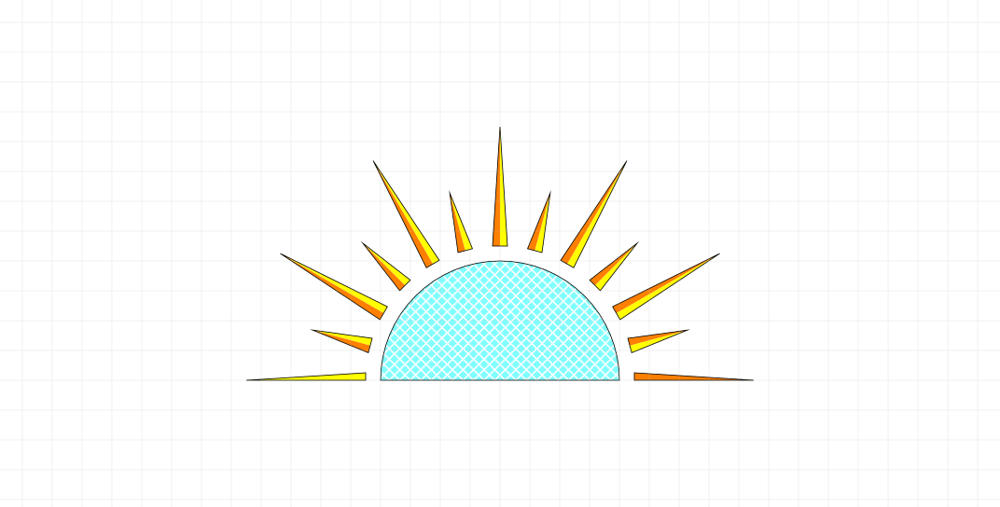
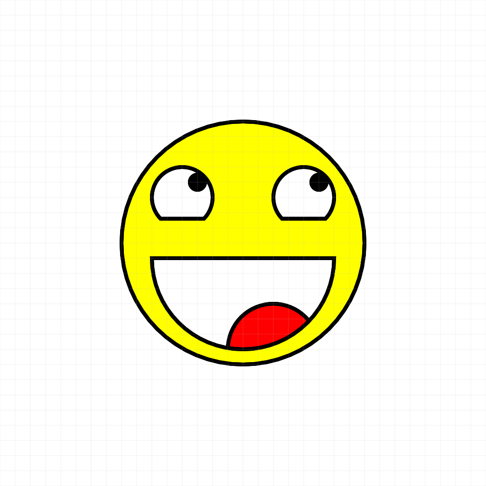

# Caddy

A simple functional language for drawing pretty pictures.

## Running a program

The interpreter can be accessed through the `caddy` executable.
There is currently no installer, and so the commands below assume that you are in the same directory as the
the `caddy` executable.

```bash
$ ./caddy path/to/program.caddy
```

will create a file called `program.png` in the current directory containing the output of the program.
The `-o` option can be used to specify a different output path.
The `-p` option can be used to print (to stdout) a textual representation of the program output.

```bash
$ echo "1+1" | ./caddy /dev/stdin -p
2
```

There are a few programs in the examples directory.

The output of `sun.caddy` should be


The output of `smile.caddy` should be


## Language Overview

TODO

